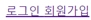
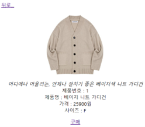
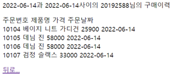

## shopping-mall-system

## 주제: 스프링 프레임워크를 사용한 쇼핑몰 사이트 구현
2022.06.

## 1. 구현 내용
**1) 대문 페이지**
-	대문 페이지에는 환영 메세지와 전체 상품 조회, 상품 검색 창, 상품 안내 페이지 링크가 공통적으로 있고, 로그인 전에는 회원가입, 로그인 링크가, 로그인 후에는 회원정보 조회, 회원정보 수정, 구매이력, 로그아웃, 탈퇴 링크가 각각 있다.
-	로그인 전 

-	로그인 후 

  

**2) 회원 관리 기능** 
(1)	회원가입
-	로그인 전 대문페이지에서 회원가입 링크를 클릭해 회원가입이 가능하다. 회원 정보에는 아이디, 암호, 이름, 생년월일, 이메일, 주소, 전화번호가 들어간다. 
 

-	검증 기능 구현 
  o	아이디, 암호, 이름, 생년월일, 이메일, 전화번호는 필수 입력 정보이고, 생년월일과 이메일, 전화번호는 형식을 맞춰서 입력해야 한다. 또한, 이미 존재하는 아이디, 이메일, 전화번호를 사용할 수 없다. 
  o	아무것도 입력하지 않았을 때 
   
  o	일부 필드 입력 오류 
   
  o	이미 존재하는 (중복) 아이디, 이메일, 전화번호 입력했을 때 
   
  o	회원가입 완료 페이지 
   

(2)	로그인
-	로그인 전 대문페이지에서 로그인 링크를 클릭해 로그인이 가능하다. 아이디와 비밀번호로 로그인한다. 

-	아이디 저장 기능: 로그인한 아이디가 저장되어 로그아웃 후 다시 로그인 할 때 저장된 아이디를 사용할 수 있다. 

-	검증 기능 구현 
  o	아무것도 입력하지 않았을 때 
   
  o	비밀번호를 입력하지 않았을 때 
   
  o	아이디, 비밀번호가 틀렸을 때 
   
  o	로그인 완료 페이지 
   

(3)	회원정보 조회
-	로그인 후 대문 페이지에서 회원정보 조회 링크를 통해 아이디, 이름, 생년월일, 이메일, 주소, 전화번호 조회 가능 
 

 

(4)	회원정보 수정
-	로그인 후 대문 페이지에서 회원정보 수정 링크를 통해 이름, 생년월일, 이메일, 주소, 전화번호 수정 가능
-	검증 기능 구현 
  o	아무것도 입력하지 않았을 때 
   
  o	일부 필드 입력 오류 
   
  o	이미 존재하는 (중복) 이메일, 전화번호 입력했을 때 (자신의 원래 이메일, 전화번호는 가능) 
  
   
  o	회원정보 수정 완료 페이지 
   
-	수정 후 회원정보 조회 페이지에서 회원정보 다시 조회 
 

(5)	로그아웃
-	로그인 후 대문 페이지에서 로그아웃 링크를 누르면 로그아웃 완료 페이지가 뜨며 로그아웃이 되고, 뒤로가기를 누르면 로그인 전 대문 페이지가 나온다. 
 
 
(6)	탈퇴
-	로그인 후 대문 페이지에서 탈퇴 링크를 누르면 탈퇴 완료 페이지가 뜨며 로그아웃, 탈퇴가 되고, 뒤로가기를 누르면 로그인 전 대문 페이지가 나온다. 
 
-	탈퇴 후에는 같은 아이디, 비밀번호로 로그인 시도 시 로그인 불가능하다. 
 
-	탈퇴 후 같은 아이디로 다시 회원가입해도 구매이력은 남아있지 않다. 
 

**3) 상품 조회 기능** 
(1)	전체 상품 조회
-	대문 페이지에서 전체 상품 조회(각 상품의 이미지, 상품 안내 페이지 링크)가 가능하다. 
  

(2)	상품 검색
-	대문 페이지에서 상품명으로 상품 검색이 가능하다. 
 
 
    o	검색 결과 있을 때: 검색한 상품이 검색 결과에 뜨고, 그 상품의 이미지와 상품 안내 페이지로 들어갈 수 있는 링크가 나온다. 
    
     

    o	검색 결과 없을 때 
    
     

**4) 상품 안내 페이지** 
(1)	상품 설명
-	대문페이지에서 상품명을(링크를) 클릭하면 상품 안내 페이지로 들어갈 수 있다. 

 
  
(2)	구매
-	로그인 후에 대문페이지에서 상품명을(링크를) 클릭하면 상품 안내 페이지에 구매 버튼이 있다. (로그인 전에는 구매 버튼이 없다.) 
 

-	구매 버튼을 누르게 되면 구매 완료 페이지가 나오고 구매가 완료되어 구매이력에 해당 제품에 추가된다. 
  

**5) 구매 이력 조회** 
-	로그인 후 대문페이지에서 구매 이력 링크를 클릭해 구매 이력 조회 페이지로 들어가 구매 이력을 조회할 수 있다. 

(1)	전체 구매 이력 조회
  -	구매 이력 링크를 클릭하면 전체 구매 이력을 바로 조회할 수 있다. 
  -	주문번호, 구매한 상품명, 가격, 주문날짜를 조회 가능하다. 
  
   
  -	구매 이력이 없을 경우 
   
 
(2)	특정 상품명으로 검색 가능
  -	구매 이력 조회 페이지에서 특정 상품명을 입력해 해당 상품의 구매 이력을 조회 가능하다. 
   
  -	검색 결과 해당 상품의구매 이력이 없을 때 
   
  -	검색 결과 해당 상품의 구매 이력이 있을 때 
   
 
(3)	기간 별 검색 기능
  -	구매 이력 조회 페이지에서 기간으로 구매이력 조회 링크를 클릭하여 기간 별 검색 페이지에서 기간 별 검색이 가능하다. 
   
  -	검색 결과 해당 기간에 구매 이력이 없을 때 
  
   
  -	검색 결과 해당 기간에 구매 이력이 있을 때 
  
   
  
(4)	검증 기능 구현
  -	아무것도 입력하지 않았을 때 
   
  -	기간1이 기간2보다 클 때 
   

## 2. 구현 방법
**0) 구현에 쓰인 파일들** 

 

**1) 뷰 인터페이스: HTML기반 웹 페이지에 표시** 
(1)	JSP 기반으로 스프링 MVC를 사용하여 구현하였다. 
(2)	상품 설명 페이지에 이미지를 사용하고 상품 설명을 깔끔하게 보이게 하기 위해 중간정렬해주었다. 
 
(3)	Div 태그를 사용해 웹페이지 레이아웃을 정리해주었다. 

 
 
**2) 모델 구현** 
(1)	자바 코드 내에 임의로 내부 데이터 구조를 정의해서 사용하였다.
-	homecontroller에서 productList, orderList, userList를 사용하였다.
-	productList는 상품리스트로 상품들의 정보를 저장하였다. 
  o	상품 정보는 제품번호, 제품명, 가격, 사이즈, 제품설명이다. 
  o	homecontroller에서 상품리스트에 5개의 상품을 저장하였다.
-	orderList는 주문리스트로 주문정보들을 저장하였다. 
  o	주문번호, 주문한 회원아이디, 제품명, 가격, 주문날짜
-	userList는 사용자리스트로 회원정보들을 저장하였다. 
  o	아이디, 암호, 이름, 생년월일, 이메일, 주소, 전화번호
 

**3) 콘트롤러 구현** 
(1)	요청 매핑
-	RequestMapping을 사용하여 jsp의 입력값을 요청하고 입력 내용을 받았다.
 

(2)	커맨드 객체 검증 및 에러 처리
-	커맨드 객체 검증 기능을 하는 UserInfoValidator 클래스와 @Valid 애노테이션을 사용하여 입력값을 검증하였다. 
  o	커맨드 객체 기능을 하는 UserInfoValidator 클래스 
   
  o	HomeController에서 UserInfoValidator 사용 
   
  o	@Valid 사용 위해 UserInfo, OrderPeriod 클래스의 멤버변수에 애노테이션 추가 
  
   
  o	@Valid 애노테이션 사용 
  
   
  
-	If문과 메시지 프로퍼티를 사용해 에러를 처리하였다. 
  o	Ex. 중복 이메일, 전화번호라면 에러메세지 전달 
   

(3)	리다이렉트
-	@postMapping 애노테이션이 있는 매서드에 대한 redirect를 구현하였다. 

 
-	로그인 하지 않았을 때 해당 링크로 들어갈 수 없게 redirect를 구현하였다. 

 

(4)	폼 태그
-	Form 태그를 사용해 jsp에서 입력한 값을 컨트롤러로 보내주었다. 
  o	Ex. Modifyuserinfo.jsp에서 form 태그를 사용해 입력값을 userInfo의 멤버변수로 입력하여 컨트롤러의 submituserinfo로 보내줌 
   
 
(5)	메시지 프로퍼티
-	Label_ko.properties를 사용해 jsp에서 메시지를 레이블을 사용해 전달하였다. 
 
 
-	Ex. 로그인 완료 메시지 전달 
 
 
 
(6)	날짜 변환
-	사용자 정의 태그를 사용해 yyyy-MM-dd 패턴으로 날짜를 변환해준다.  
  o	Userinfo.jsp에서 사용자 정의 태그 파일 사용해 날짜 변환 
   
   
  
     

(7)	@PathVariable
-	@PathVariable 애노테이션을 사용해 로그인한 사용자에 따라 회원정보조회와 구매이력조회 시 경로를 다르게 한다. 
 
 
